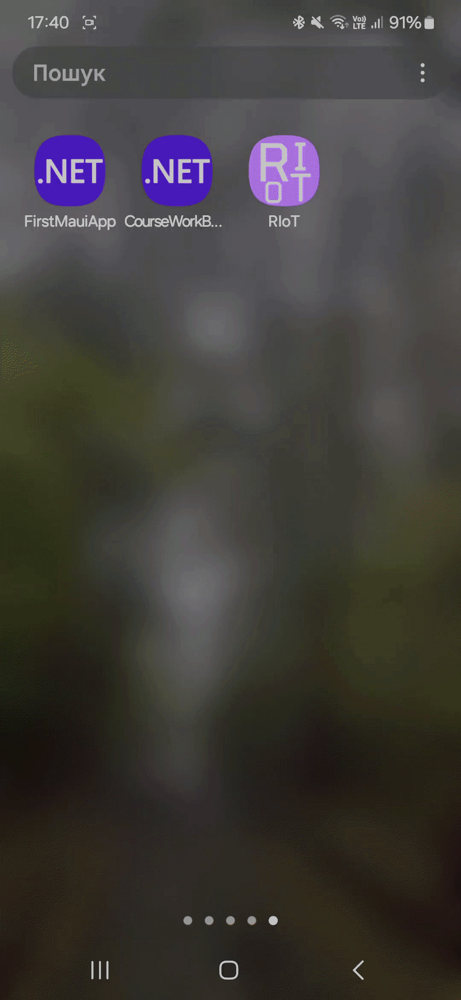
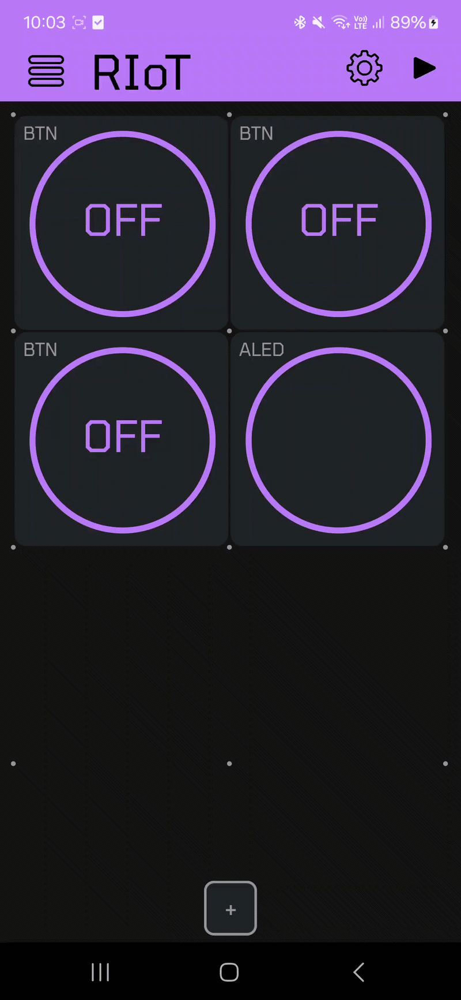

# RIoT

Cross platform app for controlling and acquiring data from ESP32 devices. Developed using MAUI.net framework

## Usage Demo
#### 1. Creating/Opening/Saving Projects

#### 2. Creating interface and using it

#### 3. Changing polling rate

#### 4. IDLE Mode 

Runs pre-programmed commands when app enters background mode 

#### 5. Sending Notifications

